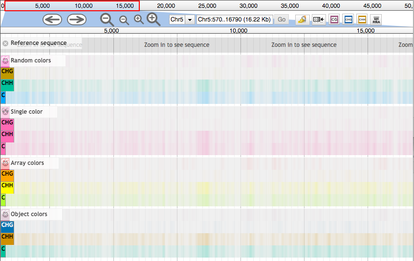
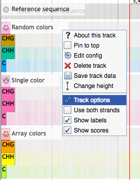
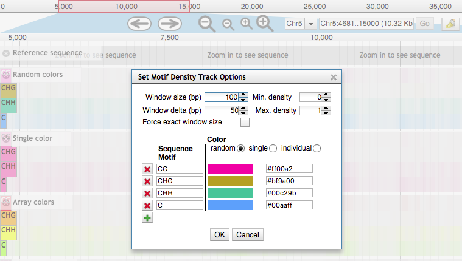

# Sequence Motif Density Plugin

[](https://travis-ci.org/bhofmei/jbplugin-motifdens)

Allows the user to create multi-lined heatmaps for different sequence motifs. User can set the color for each motif, a single color for all contexts, or "random" colors will be chosen (see [below](#color-parameters)).

Note: This plugin was previously developed up [NucleotideDensityPlugin](https://github.com/bhofmei/jbplugin-nucdens) but has been renamed to accurately describe it's functionality.
_NucleotideDensityPlugin_ will no longer be developed.

## Special Thanks
Special thanks to [Colin Diesh](http://cmdcolin.github.io/) who inspired components of this plugin. Particularly, the [GC Content plugin](https://github.com/elsiklab/gccontent) (for the storage class) and [Multi BigWig plugin](https://github.com/elsiklab/multibigwig) (for multiple density tracks).

"Random" color generation was possible thanks to [Chroma.js](https://github.com/gka/chroma.js/). A copy downloaded March 16, 2017 is included in this plugin.

## Install

For JBrowse 1.11.6+ in the _JBrowse/plugins_ folder, type:  
`git clone https://github.com/bhofmei/jbplugin-motifdens.git MotifDensityPlugin`

**or**

downloaded the latest release version at [releases](https://github.com/bhofmei/jbplugin-motifdens/releases).  
Unzip the downloaded folder, place in _JBrowse/plugins_, and rename the folder _MotifDensityPlugin_

## Activate

Add this to _jbrowse.conf_ under `[GENERAL]`:
```
[plugins.MotifDensityPlugin]
location = plugins/MotifDensityPlugin
```

If that doesn't work, add this to _jbrowse_conf.json_:
```json
"plugins" : {
    "MotifDensityPlugin" : { 
        "location" : "plugins/MotifDensityPlugin"
    }
}
```

## Test
Sample data is included in the plugin to test that the plugin is working properly. With `URL` as the URL path to the JBrowse instance, navigate a web browser to `URL/index.html?data=plugins/MotifDensityPlugin/test/data`.



**Note**: sometimes the density doesn't fully load the first time. Deselect track and readd.

## Using Nucleotide Density Tracks

Loading the track may take awhile for large region and/or many motifs.

### Example
```json
{  
    "key" : "Nucleotide Density",
    "label" : "nuc_dens",
    "storeClass" : "JBrowse/Store/SeqFeature/SequenceChunks",
    "type": "NucleotideDensityPlugin/View/Track/NucleotideDensity",
    "urlTemplate" : "seq/{refseq_dirpath}/{refseq}-",
    "motifs" : ["CG", "CHG", "CHH", "C"]
}
```
    
Sequence contexts must be specified in an array.   
[Degenerate/IUPAC](http://www.bioinformatics.org/sms/iupac.html) nucleotides are supported. Gaps are not. Nucleotides can be lowercase or uppercase.
    
### Color Parameters
For all motifs, density is indicated by the intensity of color. Color is computed as a blend between the background color and specified color weighted by the scaled density.  
Density is scaled to the track configuration `min_score` and `max_score`.
 
Color can be specified in four ways.
 
1. Random [default]    
Equidistant colors are assigned to each context based on the number of contexts specified. 
```json
    "colors": "random"
```

2. Single Color    
A single color is used for all contexts. Color can be specified as a string or hexidecimal value
```json
    "colors" : "hotpink"
```

3. Array    
Colors in the array for assigned to each context based on order. If there are more contexts than colors specified, colors are reused in order.
```json
    "colors" : ["red", "orange", "yellow", "greenyellow"]
```

4. Object    
Colors can be specified using a javascript object assigning a color to each context. If a context is not assigned a color, the cooresponding "random" color is used.
```json
    "colors" : { "CG" : "#A36085", "CHG": "#0072B2", "CHH" : "#CF8F00", "C" : "#00c29b" }
```

### Dialog Menu
Many of the parameters and settings can be adjusted using a dialog box in the track menu. Motifs can be added and removed. Colors can be changed to any of the possible color parameter types. The minimum and maximum density can be set to improve visualization. And the window size and window delta can be adjusted.




  
### Addititional Parameters
Additional parameters that can be specified for the track configuration.
* `"min_score" : 0`  , minimum density when computing color
* `"max_score" : 1`  , maximum density when computing color
* `"windowSize" : 100`  , window size for sliding window when computing density
* `"windowDelta" : 10`  , window step size for sliding window
* `"showLabels" : true`  , show context sublabels on track
* `"showScores" : true`  , show density value when mouse is over the track
* `"bothStrands" : false`  , use sequence on forward strand only or both strands to compute density
* `"style" : { "height" : 70 }`  , track height


## Future Plans
- Adjust window size/window delta when zoomed out really far to avoid out of memory errors and excessively long loading times
- "Loading" screen when recomputing after changing a track setting
- Ability to add track locally by adding option to menu bar, "File"
- Possibly improved score view (currently works fine but is not visually appealing)